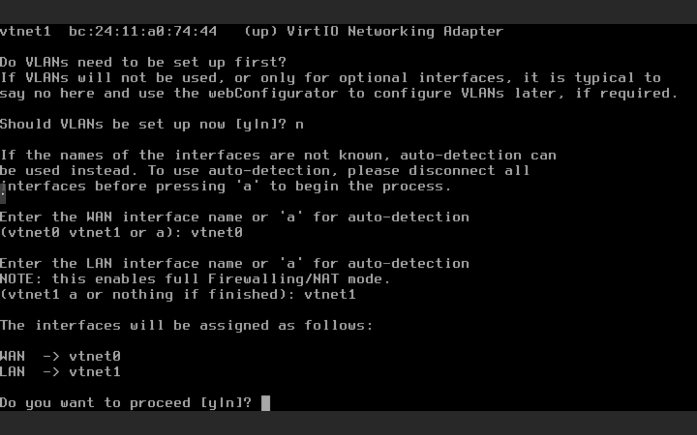
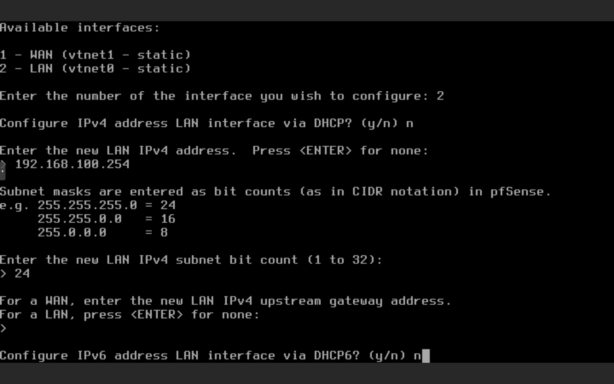
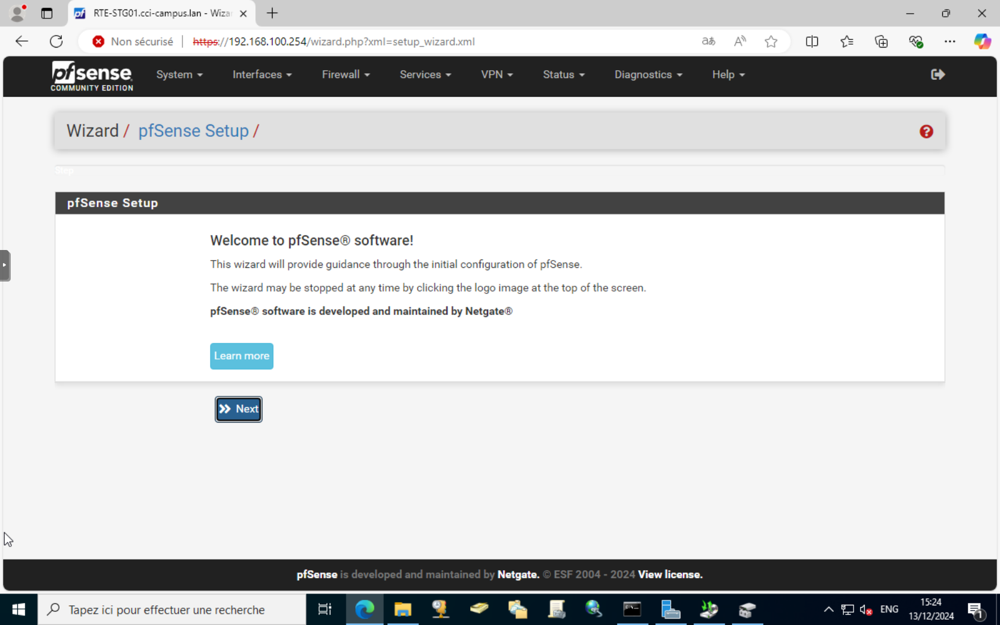
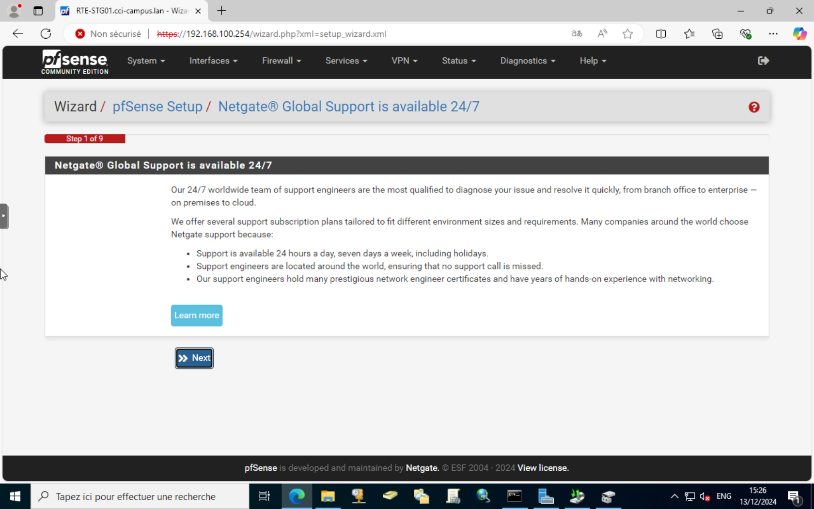
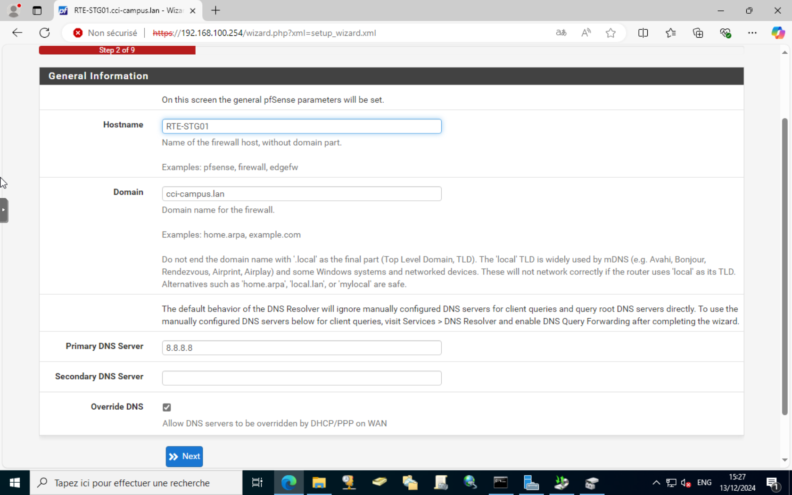
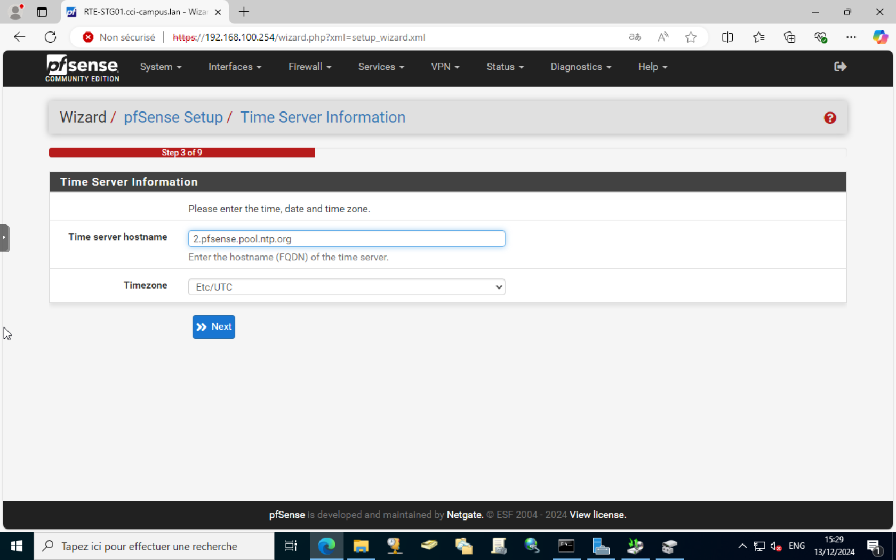
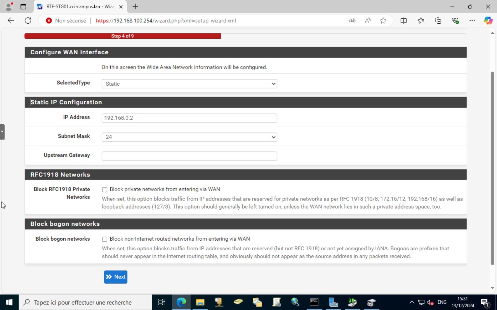
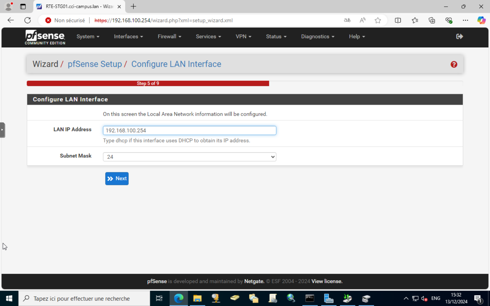
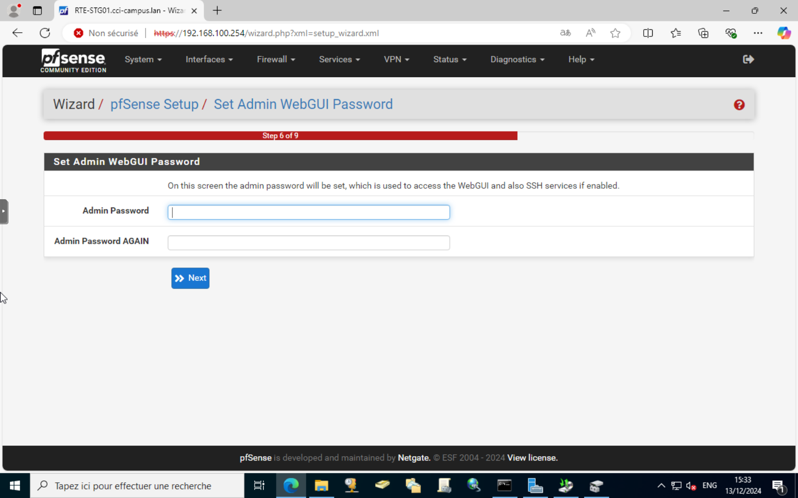
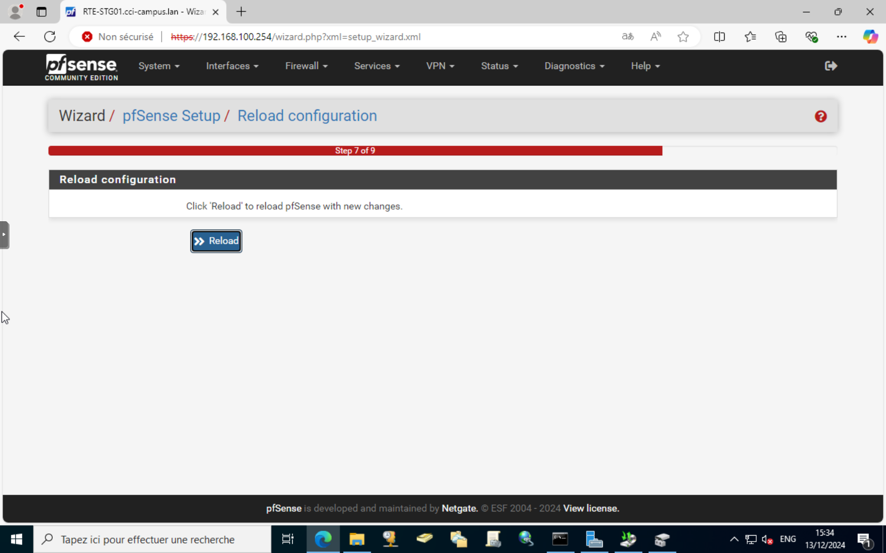

# Configuration initiale de pfSense

## Configuration des interfaces réseau

1. Après le premier démarrage, vous serez invité à configurer les interfaces réseau.
2. Assignez les interfaces réseau pour le WAN et le LAN. Par exemple :
    - WAN : em0
    - LAN : em1
3. Confirmez les interfaces assignées.

## Configuration des adresses IP

1. Configurez l'adresse IP pour l'interface LAN. Par exemple :
    - Adresse IP : 192.168.100.254
    - Masque de sous-réseau : 24 (255.255.255.0)
2. Configurez l'adresse IP pour l'interface WAN selon votre configuration réseau.

## Utilisation de l'assistant de configuration

1. Accédez à l'interface web de pfSense en entrant l'adresse IP de l'interface LAN dans un navigateur web (par exemple, http://192.168.1.1).
2. Connectez-vous avec les identifiants par défaut :
    - Nom d'utilisateur : admin
    - Mot de passe : pfsense
3. L'assistant de configuration se lancera automatiquement.

### Étape 0 : Reconnaissance du support

1. Lisez et reconnaissez les informations de support fournies par pfSense.
2. Cliquez sur "Next" pour continuer.

### Étape 1 : Informations générales

1. Configurez le nom d'hôte, le domaine et les serveurs DNS.
    - Nom d'hôte : RTE-STG01
    - Domaine : cci-campus.lan
    - Serveurs DNS : 8.8.8.8, 8.8.4.4 (ou ceux de votre choix)
2. Cliquez sur "Next" pour continuer.

### Étape 2 : Configuration de l'heure

1. Configurez le fuseau horaire approprié pour votre région.
2. Cliquez sur "Next" pour continuer.

### Étape 3 : Configuration du WAN

1. Configurez les paramètres de l'interface WAN selon votre fournisseur d'accès Internet.
2. Cliquez sur "Next" pour continuer.

### Étape 4 : Configuration du LAN

1. Vérifiez les paramètres de l'interface LAN.
2. Cliquez sur "Next" pour continuer.

### Étape 5 : Configuration du mot de passe administrateur

1. Changez le mot de passe administrateur par défaut pour des raisons de sécurité.
2. Cliquez sur "Next" pour continuer.

### Étape 6 : Finalisation

1. Cliquez sur "Reload" pour appliquer les modifications et redémarrer pfSense.
2. L'assistant de configuration est maintenant terminé.

Votre pfSense est maintenant configuré et prêt à être utilisé.
