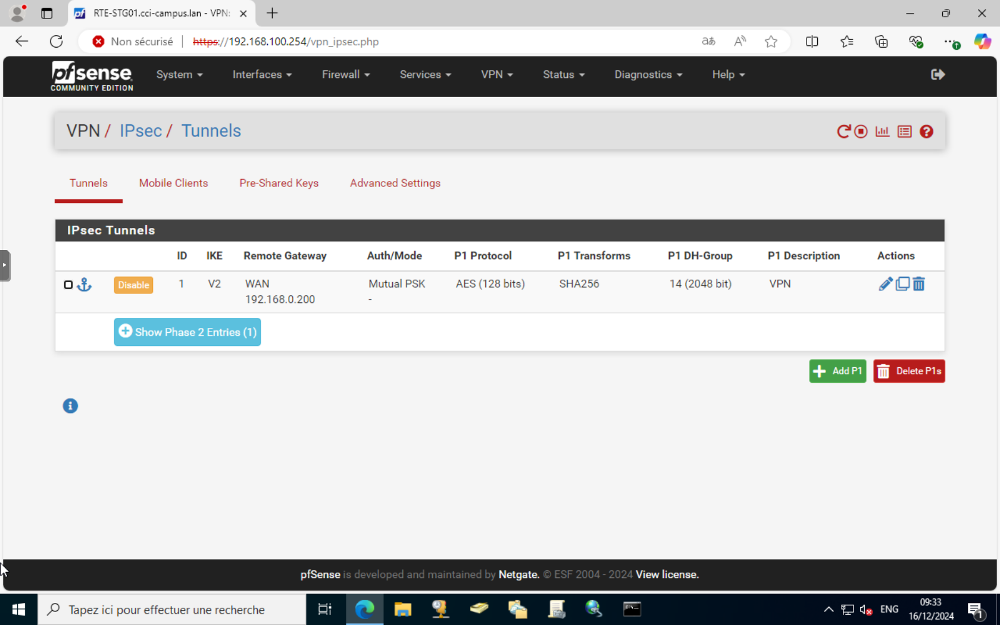
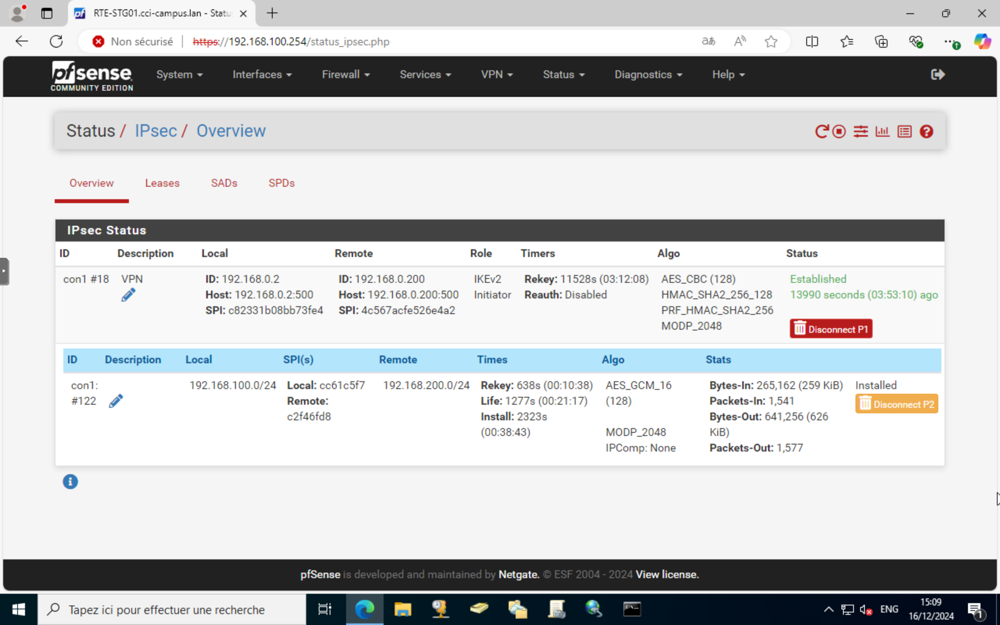
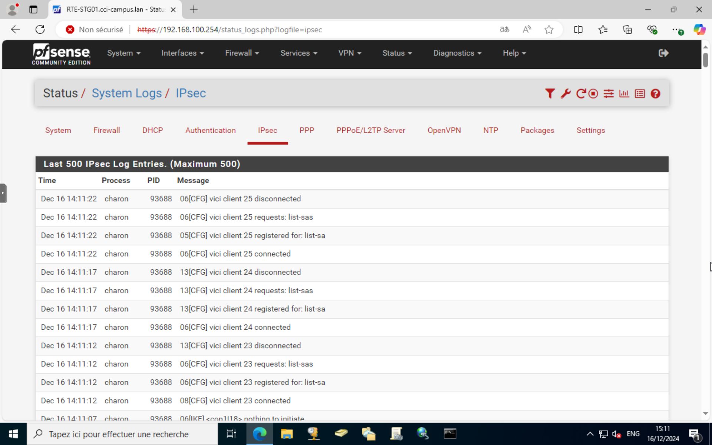

# Configuration d'un VPN IPsec sur pfSense

## Introduction

Ce guide vous expliquera comment configurer un VPN IPsec sur pfSense. Un VPN IPsec permet de sécuriser les communications entre deux réseaux distants en utilisant des protocoles de cryptage.

## Prérequis

Avant de commencer, assurez-vous d'avoir les éléments suivants :
- Une installation fonctionnelle de pfSense
- Deux interfaces réseau configurées (WAN et LAN)
- Les informations de configuration du réseau distant

## Étapes de configuration

### 1. Accéder à l'interface web de pfSense

1. Ouvrez un navigateur web et accédez à l'adresse IP du LAN de pfSense (par défaut, [http://192.168.1.1](http://192.168.1.1)).
2. Connectez-vous à l'interface web avec vos identifiants administrateur.

### 2. Configurer la phase 1 de l'IPsec

1. Allez dans `VPN` > `IPsec` > `Tunnels` et cliquez sur `Add P1`.
2. Configurez les paramètres de la phase 1 comme suit :
   - **Key Exchange version** : IKEv2
   - **Internet Protocol** : IPv4
   - **Interface** : WAN
   - **Remote Gateway** : Adresse IP du réseau distant
   - **Authentication Method** : Mutual PSK
   - **Pre-Shared Key** : Clé partagée entre les deux sites
   - **Encryption Algorithm** : AES
   - **Hash Algorithm** : SHA256
   - **DH Group** : 14
   - **Lifetime** : 28800

3. Cliquez sur `Save` pour enregistrer les paramètres.

### 3. Configurer la phase 2 de l'IPsec

1. Après avoir enregistré la phase 1, cliquez sur `Add P2` pour configurer la phase 2.
2. Configurez les paramètres de la phase 2 comme suit :
   - **Mode** : Tunnel IPv4
   - **Local Network** : Réseau local (ex. 192.168.1.0/24)
   - **Remote Network** : Réseau distant (ex. 192.168.2.0/24)
   - **Protocol** : ESP
   - **Encryption Algorithms** : AES
   - **Hash Algorithms** : SHA256
   - **PFS Key Group** : 14
   - **Lifetime** : 3600

3. Cliquez sur `Save` pour enregistrer les paramètres.

### 4. Activer le tunnel IPsec

1. Retournez à la page `Tunnels` et assurez-vous que le tunnel est activé.
2. Cliquez sur `Apply Changes` pour appliquer les modifications.

### 5. Vérifier l'état du tunnel

1. Allez dans `Status` > `IPsec` pour vérifier l'état du tunnel.
2. Assurez-vous que le tunnel est `Established` et que les paquets sont transmis.

## Dépannage

### Problèmes courants

- **Le tunnel ne s'établit pas** : Vérifiez les paramètres de configuration des deux côtés du tunnel. Assurez-vous que les clés partagées et les algorithmes de cryptage correspondent.
- **Pas de trafic à travers le tunnel** : Vérifiez les règles de pare-feu pour vous assurer que le trafic IPsec est autorisé sur les interfaces WAN et LAN.
- **Déconnexions fréquentes** : Augmentez les durées de vie des phases 1 et 2 pour réduire la fréquence des reconnections.

### Outils de diagnostic

- **Logs IPsec** : Allez dans `Status` > `System Logs` > `IPsec` pour consulter les journaux et identifier les problèmes.
- **Ping** : Utilisez l'outil `Ping` dans `Diagnostics` > `Ping` pour tester la connectivité entre les réseaux locaux et distants.

## Conclusion

Vous avez maintenant configuré un VPN IPsec sur pfSense. Ce tunnel sécurisé permet de connecter deux réseaux distants de manière sécurisée. N'oubliez pas de surveiller régulièrement l'état du tunnel et de consulter les journaux en cas de problème.
