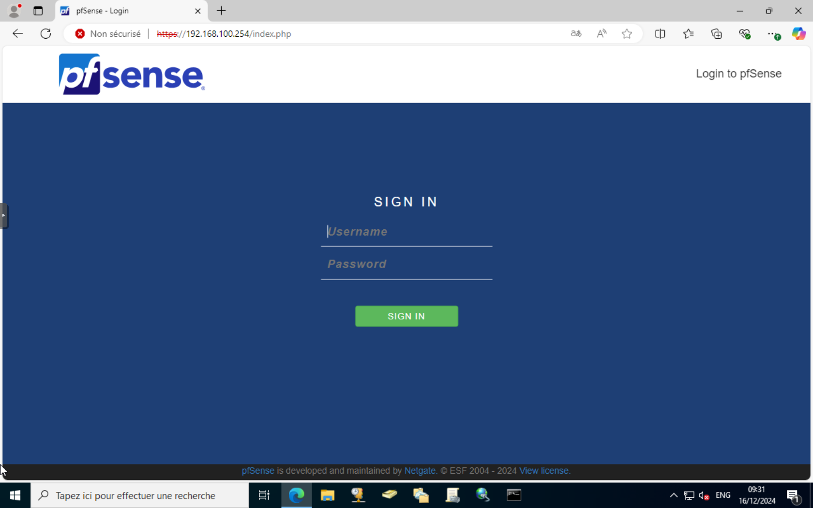
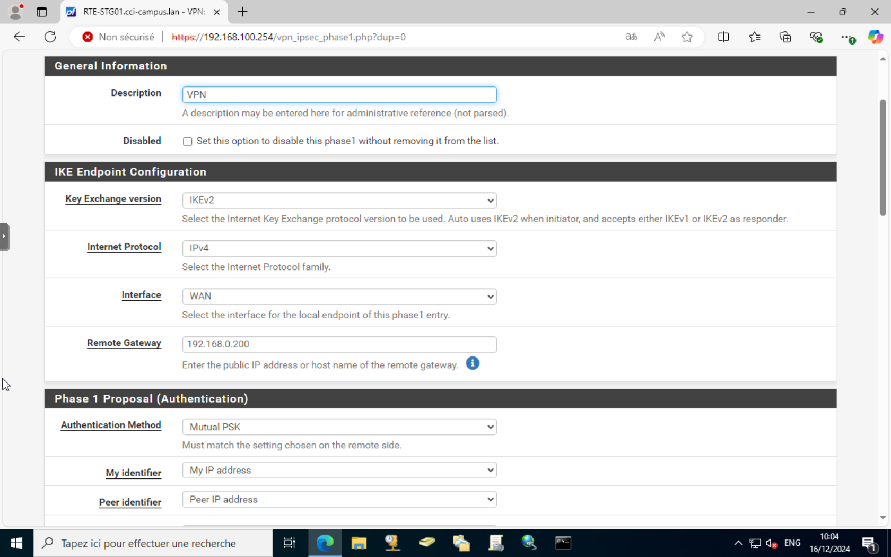
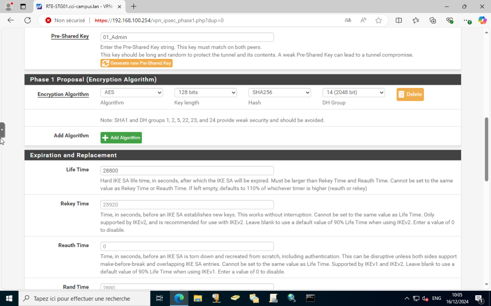
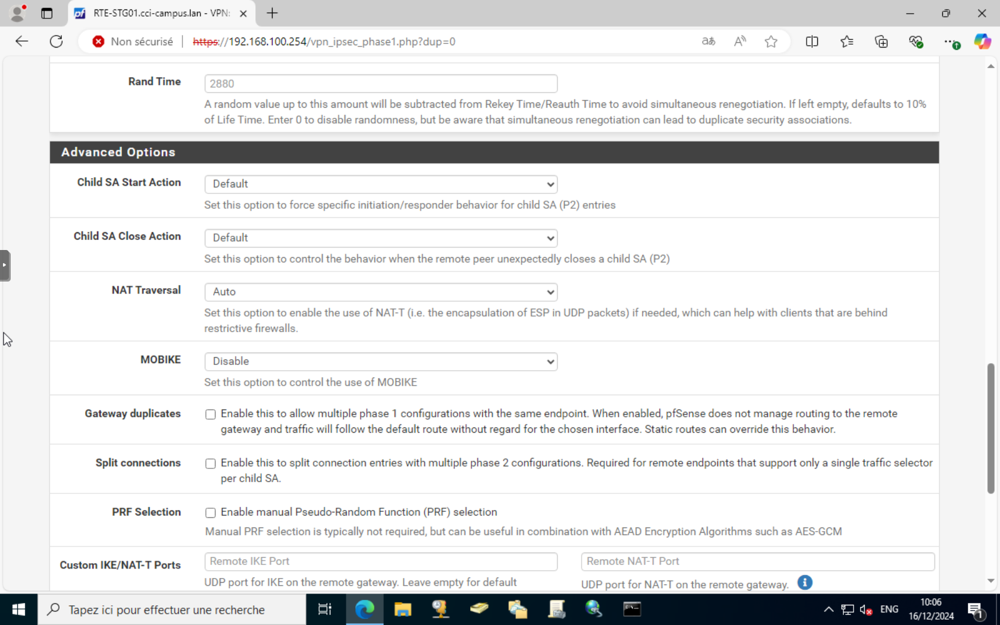
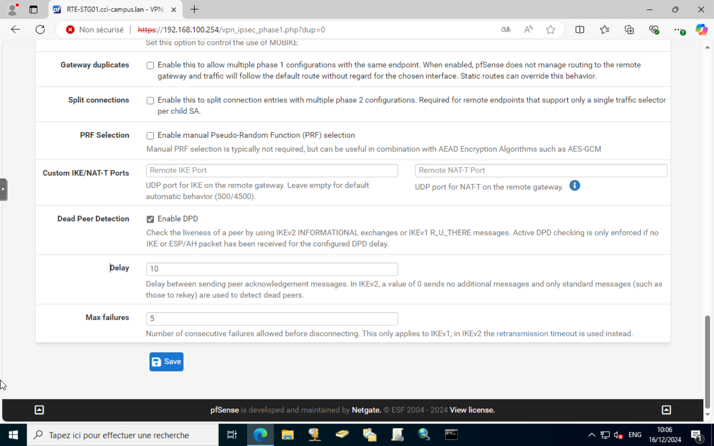
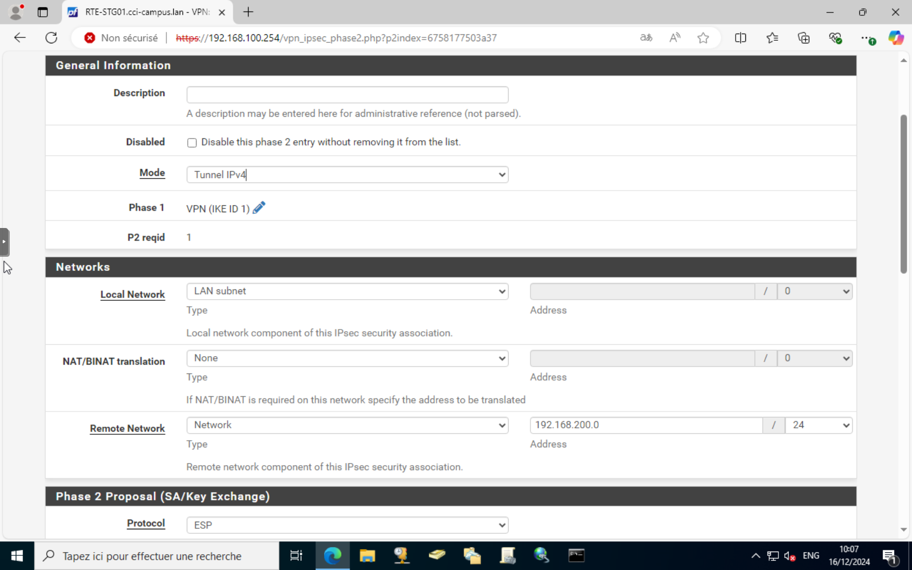

# Configuration d'un VPN IPsec sur pfSense

## Introduction

Ce guide vous expliquera comment configurer un VPN IPsec sur pfSense. Un VPN IPsec permet de sécuriser les communications entre deux réseaux distants en utilisant des protocoles de cryptage.

## Prérequis

Avant de commencer, assurez-vous d'avoir les éléments suivants :
- Une installation fonctionnelle de pfSense
- Deux interfaces réseau configurées (WAN et LAN)
- Les informations de configuration du réseau distant

## Étapes de configuration

### 1. Accéder à l'interface web de pfSense

1. Ouvrez un navigateur web et accédez à l'adresse IP du LAN de pfSense (par défaut, [http://192.168.1.1](http://192.168.1.1)).
2. Connectez-vous à l'interface web avec vos identifiants administrateur.

### 2. Configurer la phase 1 de l'IPsec

1. Allez dans `VPN` > `IPsec` > `Tunnels` et cliquez sur le bouton `Add P1` pour ajouter une nouvelle phase 1.

2. Dans la section **General Information**, configurez les paramètres suivants :
   - **Key Exchange version** : sélectionnez `IKEv2`.
   - **Internet Protocol** : choisissez `IPv4`.
   - **Interface** : sélectionnez `WAN`.
   - **Remote Gateway** : entrez l'adresse IP du réseau distant (par exemple, `203.0.113.1`).

3. Dans la section **Authentication**, configurez les paramètres suivants :
   - **Authentication Method** : choisissez `Mutual PSK`.
   - **Pre-Shared Key** : entrez la clé pré-partagée convenue avec l'administrateur du réseau distant.
   - Dans **My Identifier** et **Peer Identifier**, choisissez `My IP Address` et `Peer IP Address` respectivement.

4. Dans la section **Phase 1 Proposal (Authentication)**, configurez les paramètres suivants :
   - **Encryption Algorithm** : sélectionnez `AES` avec une clé de `256 bits`.
   - **Hash Algorithm** : choisissez `SHA256`.
   - **DH Group** : sélectionnez le groupe `14` (2048 bits pour une sécurité renforcée).

5. Dans la section **Expiration and Replacement**, configurez les paramètres suivants :
   - **Life Time** : entrez `28800` (8 heures) pour la durée de vie de la phase 1.

6. Dans la section **Advanced Options**, configurez les paramètres suivants :
   - **NAT Traversal** : Auto.
   - **Dead Peer Detection** : cochez la case pour activer la détection des pairs morts.

7. Laissez les autres paramètres par défaut sauf si vous avez des exigences spécifiques. Cliquez sur `Save` pour enregistrer les paramètres de la phase 1.

### 3. Configurer la phase 2 de l'IPsec

1. Après avoir enregistré la phase 1, cliquez sur `Add P2` pour configurer la phase 2.
2. Dans la section **General Information**, configurez les paramètres suivants :
   - **Description** : entrez un nom descriptif pour la phase 2.
   - **Mode** : choisissez `Tunnel IPv4`.
3. Dans la section **Networks**, configurez les paramètres suivants :
   - **Local Network** : choisissez le réseau local (LAN) de votre pfSense.
   - **Remote Network** : entrez le réseau distant avec lequel vous souhaitez établir la connexion (par exemple, `192.168.200.0/24`).
   - **NAT/BINAT Translation** : laissez les paramètres par défaut.

4. 

### 4. Activer le tunnel IPsec

1. Retournez à la page `Tunnels` et assurez-vous que le tunnel est activé.
2. Cliquez sur `Apply Changes` pour appliquer les modifications.

### 5. Vérifier l'état du tunnel

1. Allez dans `Status` > `IPsec` pour vérifier l'état du tunnel.
2. Assurez-vous que le tunnel est `Established` et que les paquets sont transmis.

## Dépannage

### Problèmes courants

- **Le tunnel ne s'établit pas** : Vérifiez les paramètres de configuration des deux côtés du tunnel. Assurez-vous que les clés partagées et les algorithmes de cryptage correspondent.
- **Pas de trafic à travers le tunnel** : Vérifiez les règles de pare-feu pour vous assurer que le trafic IPsec est autorisé sur les interfaces WAN et LAN.
- **Déconnexions fréquentes** : Augmentez les durées de vie des phases 1 et 2 pour réduire la fréquence des reconnections.

### Outils de diagnostic

- **Logs IPsec** : Allez dans `Status` > `System Logs` > `IPsec` pour consulter les journaux et identifier les problèmes.
- **Ping** : Utilisez l'outil `Ping` dans `Diagnostics` > `Ping` pour tester la connectivité entre les réseaux locaux et distants.

## Conclusion

Vous avez maintenant configuré un VPN IPsec sur pfSense. Ce tunnel sécurisé permet de connecter deux réseaux distants de manière sécurisée. N'oubliez pas de surveiller régulièrement l'état du tunnel et de consulter les journaux en cas de problème.
