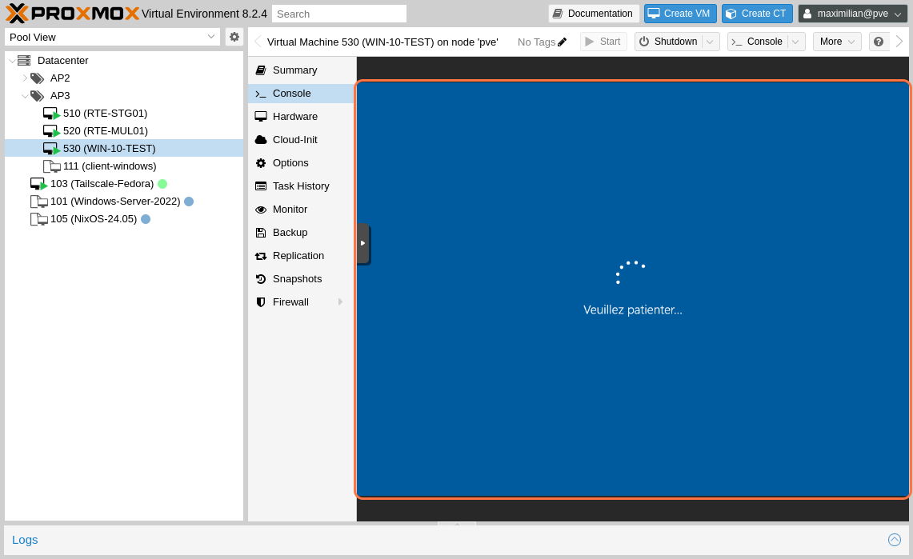

# Installation et Configuration d'un Client Windows pour Rejoindre un Domaine

## Prérequis

Avant de commencer, assurez-vous d'avoir les éléments suivants :
- Un ordinateur avec une version compatible de Windows installée
- Une connexion réseau fonctionnelle
- Les informations d'identification pour rejoindre le domaine (nom de domaine, nom d'utilisateur, et mot de passe)

## Étapes d'installation et de configuration initiale

### 1. Installation de Windows

1. Démarrez le système à partir d'un support d'installation de Windows.
2. Sélectionnez la langue, le format de l'heure et du clavier, puis cliquez sur "Suivant".

3. Cliquez sur "Installer maintenant" pour lancer l'installation.

4. Entrez la clé de licence si demandée, puis cliquez sur "Suivant".

5. Choisissez l'édition de Windows à installer et acceptez les termes du contrat de licence.

6. Sélectionnez le type d'installation. Choisissez "Personnalisé" pour effectuer une installation propre.

7. Choisissez la partition où installer Windows, puis cliquez sur "Suivant".

8. L'installation commence. Attendez que le système redémarre automatiquement.

9. Une fois l'installation terminée, le système redémarre sur l'écran de configuration initiale.

### 2. Configuration initiale de Windows

1. Sélectionnez la langue et la disposition du clavier.

2. Ajoutez un second clavier si nécessaire, ou cliquez sur "Ignorer".

3. Connectez-vous à Internet pour que Windows puisse appliquer les mises à jour.

4. Créez un compte utilisateur principal. Entrez un nom d'utilisateur et un mot de passe.

5. Configurez les questions de sécurité pour la récupération du mot de passe.

6. Décidez si vous souhaitez activer Cortana et configurez les paramètres de confidentialité selon vos préférences.

7. Attendez que Windows applique les paramètres. Vous arriverez ensuite sur le bureau.

## Rejoindre un Domaine

### 1. Accéder aux Paramètres de Domaine

1. Ouvrez les "Paramètres" en cliquant sur le menu Démarrer, puis allez dans **Système** > **Informations**.
2. Sous la section "Paramètres de nom de l’ordinateur, de domaine et de groupe de travail", cliquez sur **Modifier les paramètres**.

### 2. Configuration du Domaine

1. Dans la fenêtre "Propriétés système", cliquez sur le bouton **Modifier**.
2. Dans la section "Membre de", sélectionnez **Domaine** et entrez le nom du domaine.
3. Cliquez sur **OK**.

### 3. Authentification et Finalisation

1. Entrez les informations d'identification d'un compte autorisé à joindre des machines au domaine.
2. Redémarrez l'ordinateur lorsque vous y êtes invité.
3. Une fois redémarré, connectez-vous avec un compte utilisateur du domaine.

## Conclusion

Votre client Windows est maintenant configuré et connecté au domaine. Vous pouvez désormais gérer les paramètres du système et accéder aux ressources du réseau selon les autorisations configurées.

