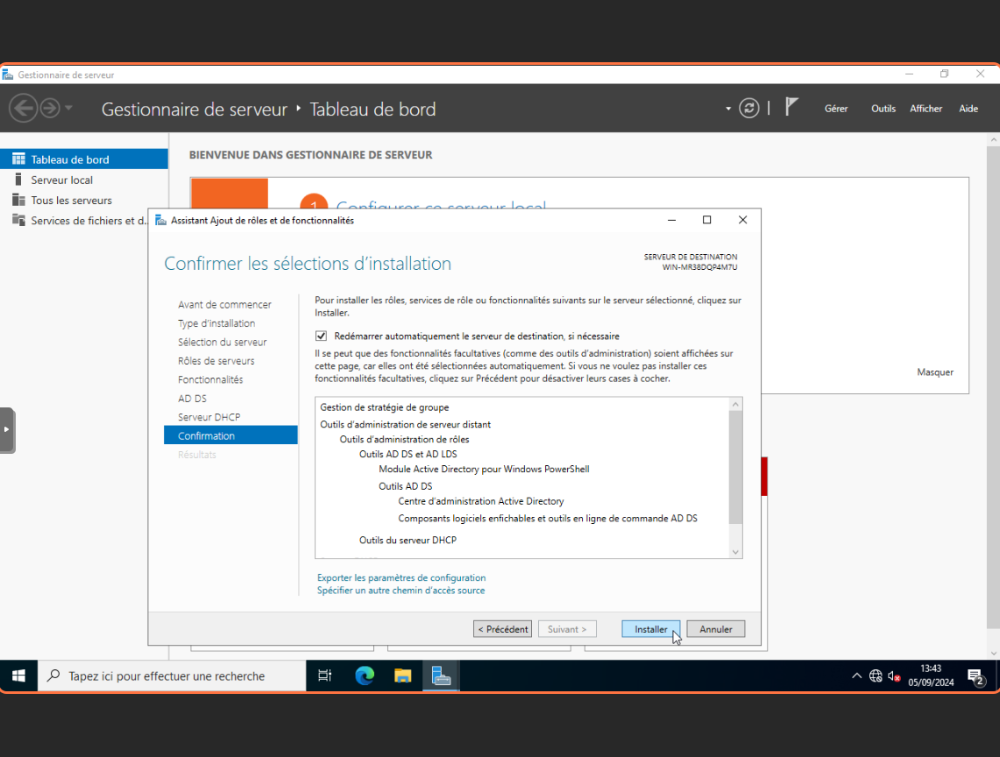

# Configuration d'Active Directory sur Windows Server

## Prérequis

Avant de commencer la configuration d'Active Directory, assurez-vous d'avoir les éléments suivants :

- Un serveur Windows Server installé
- Un accès administrateur au serveur

## Étapes de configuration

### 1. Installation du rôle Active Directory Domain Services (AD DS)

1. Ouvrez le Gestionnaire de serveur.
   
2. Cliquez sur "Ajouter des rôles et des fonctionnalités".
   
3. Sélectionnez "Installation basée sur un rôle ou une fonctionnalité" et cliquez sur "Suivant".
   
4. Sélectionnez le serveur sur lequel vous souhaitez installer le rôle AD DS et cliquez sur "Suivant".
   
5. Cochez la case "Services de domaine Active Directory" et cliquez sur "Suivant".
   
6. Cliquez sur "Ajouter des fonctionnalités" lorsque la fenêtre contextuelle s'affiche, puis cliquez sur "Suivant".
   
7. Cliquez sur "Installer" pour commencer l'installation du rôle AD DS.
   
8. Patientez jusqu'a la fin de l'installation.
   

### 2. Promotion du serveur en tant que contrôleur de domaine

1. Une fois l'installation terminée, cliquez sur "Promouvoir ce serveur en contrôleur de domaine".
   
2. Sélectionnez "Ajouter une nouvelle forêt" et entrez un nom de domaine racine (par exemple, "cci-campus.lan").
   
3. Configurez les options de niveau fonctionnel du domaine et de la forêt.
4. Entrez un mot de passe pour le mode de restauration des services d'annuaire (DSRM) et cliquez sur "Suivant".
   
5. Configurez les paramètres DNS et NETBIOS si nécessaire.
   
   
6. Spécifiez le chemin d'accès pour les fichiers AD DS.
   
7. Confirmez les options de configuration et cliquez sur "Suivant".
   
8. Redémarrez le serveur si nécessaire.
   

### 3. Renommage et redémarrage du serveur

1. Avant de continuer, renommez le serveur avec un nom pertinent.
   
   
2. Appliquez les modifications et redémarrez le serveur.
   

### 4. Configuration des utilisateurs et des groupes

1. Ouvrez "Utilisateurs et ordinateurs Active Directory" à partir du menu Démarrer.
2. Cliquez avec le bouton droit sur le nom de domaine et sélectionnez "Nouveau" > "Utilisateur" pour créer un nouvel utilisateur.
3. Suivez les instructions à l'écran pour entrer les informations de l'utilisateur et définir un mot de passe.
4. Pour créer un nouveau groupe, cliquez avec le bouton droit sur le nom de domaine et sélectionnez "Nouveau" > "Groupe".
5. Entrez le nom du groupe et configurez les paramètres selon vos besoins.

### 5. Configuration des unités d'organisation (OU)

1. Ouvrez "Utilisateurs et ordinateurs Active Directory".
2. Cliquez avec le bouton droit sur le nom de domaine et sélectionnez "Nouveau" > "Unité d'organisation".
3. Entrez un nom pour l'unité d'organisation et cliquez sur "OK".
4. Vous pouvez maintenant déplacer des utilisateurs et des groupes dans cette unité d'organisation en les faisant glisser et en les déposant.

## Dépannage

### Problèmes courants et solutions

- **Problème : Le serveur ne peut pas être promu en tant que contrôleur de domaine.**
  - **Solution :** Vérifiez que le serveur a une adresse IP statique et que les paramètres DNS sont correctement configurés.

- **Problème : Les utilisateurs ne peuvent pas se connecter au domaine.**
  - **Solution :** Assurez-vous que les utilisateurs sont correctement configurés dans Active Directory et que leurs mots de passe sont corrects.

- **Problème : Les unités d'organisation ne sont pas visibles.**
  - **Solution :** Vérifiez que vous avez les autorisations nécessaires pour afficher et gérer les unités d'organisation.

## Conclusion

Vous avez maintenant configuré Active Directory sur Windows Server. Vous pouvez commencer à gérer les utilisateurs, les groupes et les unités d'organisation selon vos besoins.
