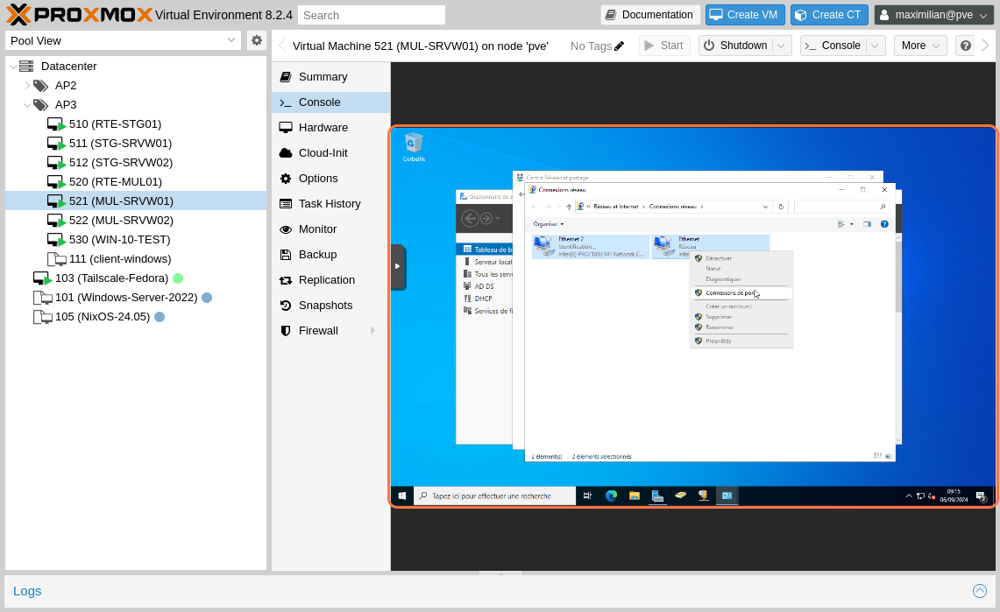
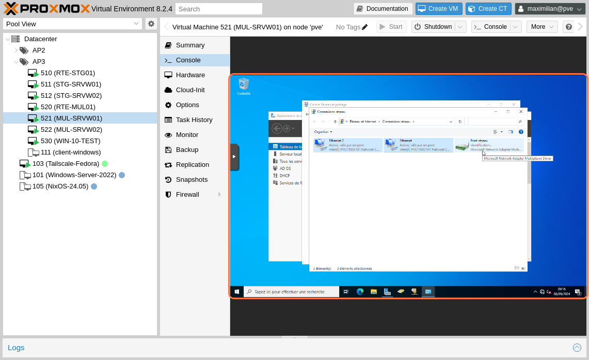
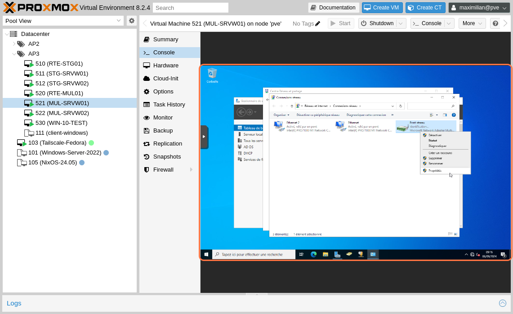
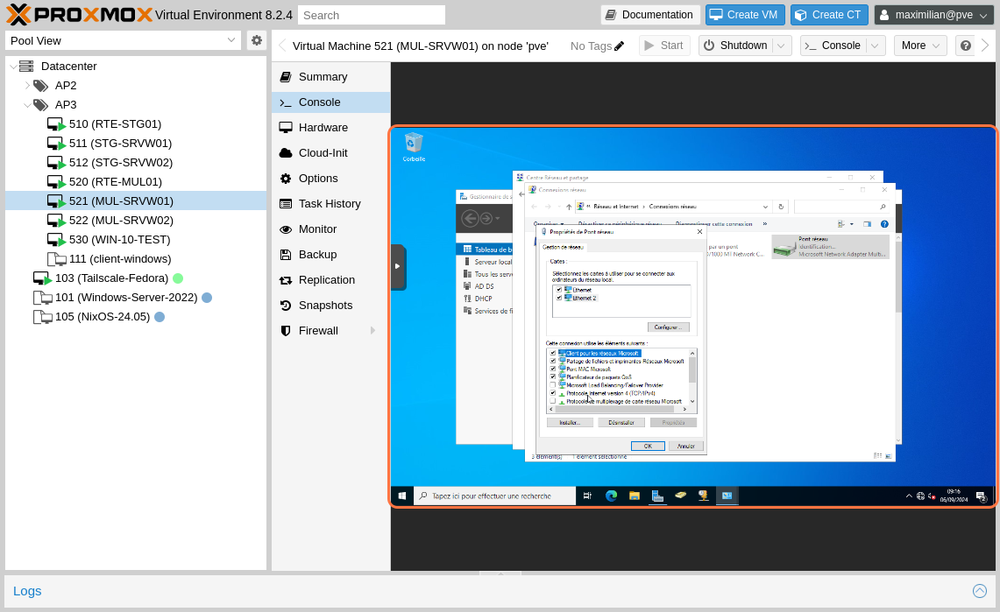
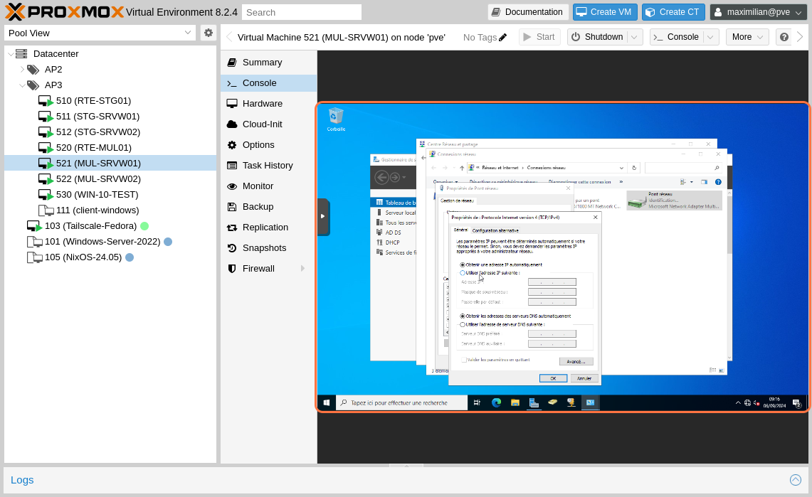

# Configuration du Pont entre Deux Cartes Réseau sur Windows Server pour Haute Disponibilité (HA)

## Prérequis

Avant de commencer la configuration, assurez-vous d'avoir les éléments suivants :
- Un serveur Windows Server installé et configuré
- Deux cartes réseau fonctionnelles connectées à des réseaux appropriés
- Accès administrateur au serveur

## Étapes de Configuration

### 1. Accéder à la Gestion des Cartes Réseau

1. Ouvrez le Panneau de configuration.
2. Cliquez sur "Réseau et Internet" puis sur "Centre réseau et partage".
3. Dans le volet gauche, cliquez sur "Modifier les paramètres de la carte".
   

### 2. Sélectionner les Cartes Réseau à Combiner

1. Identifiez les deux cartes réseau que vous souhaitez utiliser pour la haute disponibilité.
2. Cliquez avec le bouton droit sur l'une des cartes réseau et sélectionnez "Pont de connexion".
3. Maintenez la touche Ctrl enfoncée, puis cliquez sur la seconde carte réseau pour la sélectionner.

### 3. Création du Pont Réseau

1. Avec les deux cartes réseau sélectionnées, cliquez avec le bouton droit et choisissez "Pont de connexion".
   
2. Windows créera un pont réseau. Cela peut prendre quelques instants.
   
3. Une fois terminé, vérifiez que le pont réseau est créé correctement et fonctionne.

### 4. Configurer les Paramètres du Pont

1. Cliquez avec le bouton droit sur le pont réseau nouvellement créé et sélectionnez "Propriétés".
   
2. Assurez-vous que les protocoles requis, tels que TCP/IPv4, sont activés.
   
3. Si nécessaire, attribuez une adresse IP statique au pont réseau.
   
4. Cliquez sur "OK" pour appliquer les modifications.

## Tests et Validation

1. Vérifiez que le pont réseau transmet correctement les données entre les deux réseaux.
2. Testez la continuité de la connexion en déconnectant physiquement une carte réseau et en confirmant que la communication continue.
3. Surveillez les performances du pont à l'aide des outils d'administration Windows.

## Dépannage

### Problèmes Courants et Solutions

- **Problème : Le pont ne se crée pas.**
  - **Solution :** Assurez-vous que les deux cartes réseau sont activées et connectées.

- **Problème : Perte de connexion intermittente.**
  - **Solution :** Vérifiez que les drivers des cartes réseau sont à jour.

- **Problème : Le pont ne transmet pas le trafic.**
  - **Solution :** Configurez correctement les paramètres IP et assurez-vous qu'il n'y a pas de conflits d'adresse.

## Conclusion

Vous avez maintenant configuré un pont entre deux cartes réseau pour assurer une haute disponibilité sur Windows Server. Cette configuration peut aider à améliorer la redondance et la fiabilité de votre infrastructure réseau.

