# Installation de pfSense

## Prérequis matériels
Avant de commencer l'installation de pfSense, assurez-vous d'avoir le matériel suivant :

- Un ordinateur, un serveur, ou une machine virtuelle avec au moins deux interfaces réseau (une pour le WAN et une pour le LAN)
- Un processeur compatible avec l'architecture x86-64
- Au moins 1 Go de RAM (2 Go ou plus recommandés)
- Au moins 4 Go d'espace disque (8 Go ou plus recommandés)
- Un lecteur USB ou un CD/DVD pour l'installation

## Étapes d'installation

### 1. Téléchargement de l'image d'installation

1. Rendez-vous sur le site officiel de pfSense : [https://www.pfsense.org/download/](https://www.pfsense.org/download/)
2. Sélectionnez la version de pfSense que vous souhaitez installer.
3. Choisissez l'architecture appropriée (généralement AMD64 pour les systèmes modernes).
4. Sélectionnez le type d'installation (USB Memstick Installer ou CD Image).
5. Téléchargez l'image d'installation.

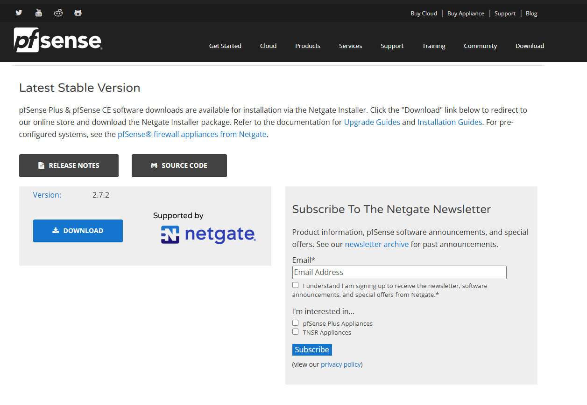

### 2. Création du support d'installation

1. Si vous avez téléchargé l'image USB, utilisez un outil comme Rufus pour créer une clé USB bootable.
2. Si vous avez téléchargé l'image CD, gravez l'image sur un CD/DVD.
3. Si vous utilisez une machine virtuelle, créez une nouvelle machine virtuelle avec les paramètres suivants :
    - Type de système d'exploitation : BSD
    - Version : FreeBSD (64-bit)
    - Montez l'image d'installation téléchargée comme lecteur CD/DVD virtuel

### 3. Démarrage à partir du support d'installation

1. Insérez la clé USB ou le CD/DVD dans l'ordinateur ou le serveur sur lequel vous souhaitez installer pfSense.
2. Démarrez l'ordinateur et accédez au menu de démarrage (généralement en appuyant sur une touche comme F12, F2, ou ESC).
3. Sélectionnez le support d'installation (USB ou CD/DVD) comme périphérique de démarrage.

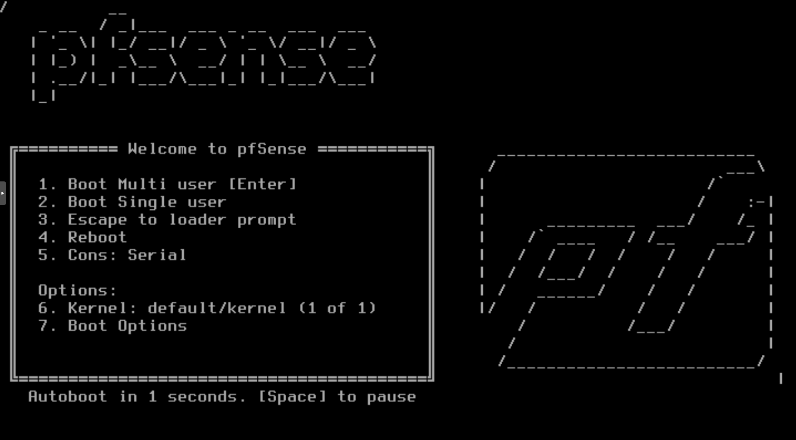

### 4. Installation de pfSense

1. Une fois que l'ordinateur a démarré à partir du support d'installation, vous verrez l'écran de copyright de pfSense.
2. Appuyez sur "Enter" pour continuer.
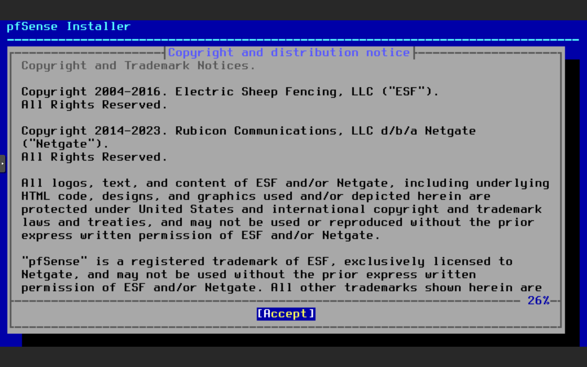
3. Vous verrez ensuite l'écran de bienvenue de pfSense. Sélectionnez "Install" pour commencer l'installation.
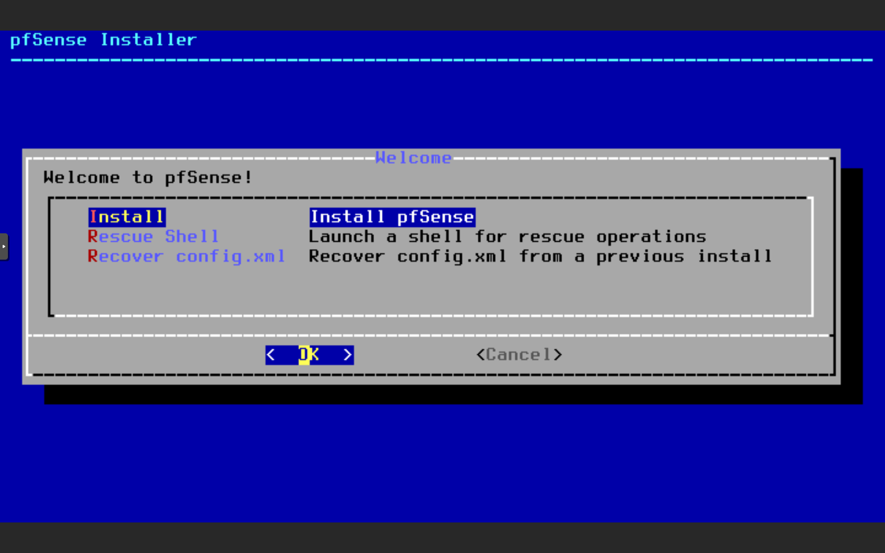
4. Suivez les instructions à l'écran pour configurer les paramètres de base (langue, disposition du clavier, etc.).
5. Vous serez ensuite invité à choisir le type de système de fichiers. Sélectionnez "ZFS" pour bénéficier des fonctionnalités avancées de ce système de fichiers.
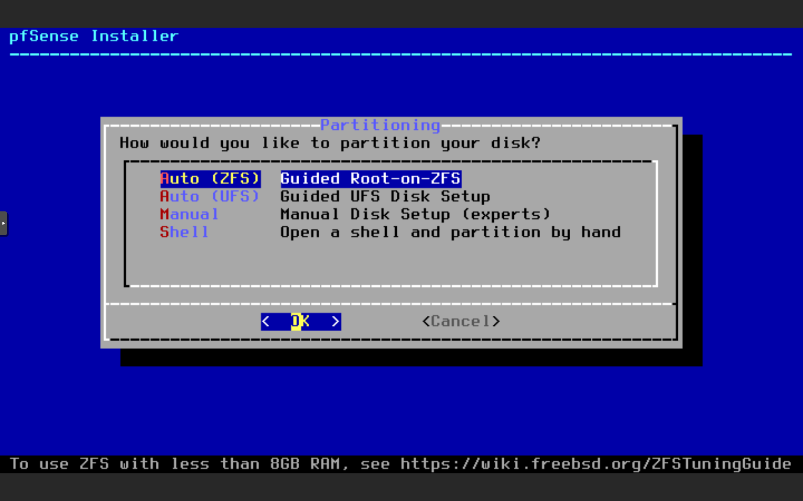
6. Sélectionnez le disque sur lequel vous souhaitez installer pfSense.
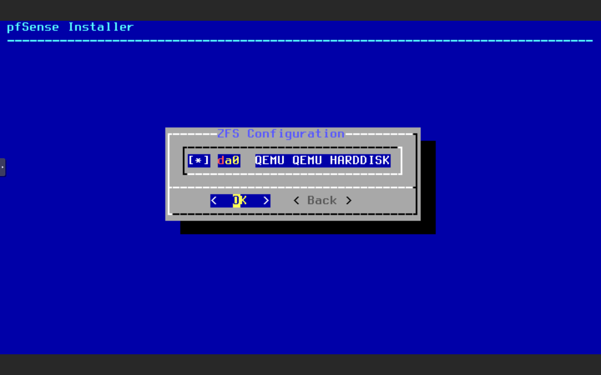
7. Sélectionnez le type de disque (RAID, Stripe, Mirror).
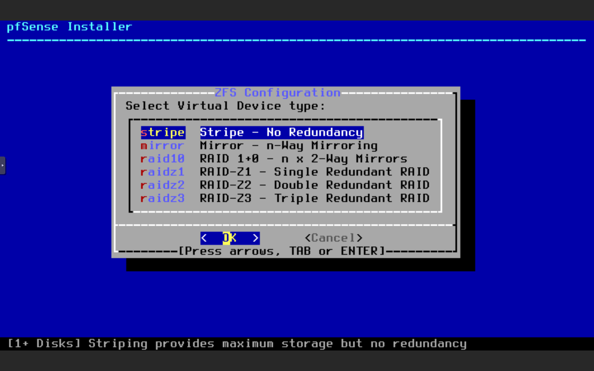
8. Confirmez la sélection du disque.
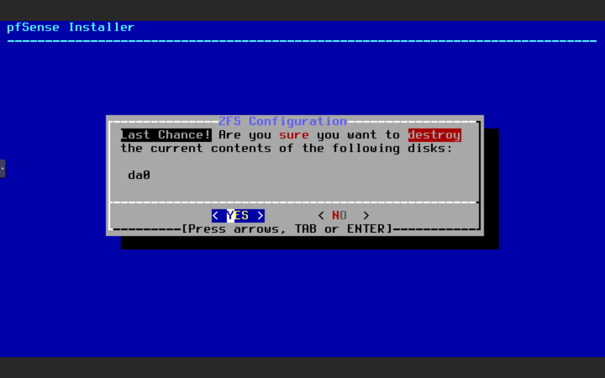
9. Confirmez l'installation de ZFS.
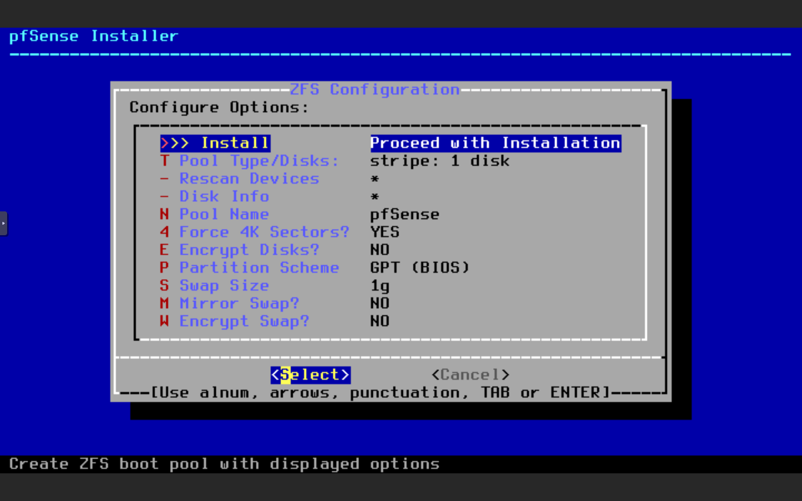
10. L'installation de pfSense commence. Patientez pendant le processus.
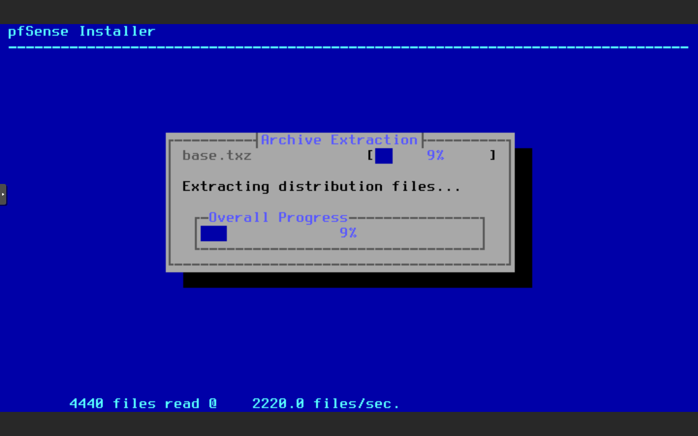
11. Une fois l'installation terminée, vous verrez l'écran de fin d'installation.
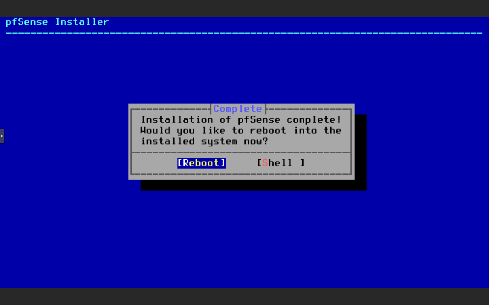

### 5. Configuration initiale

1. Retirez le support d'installation (clé USB ou CD/DVD).
2. Procéder au guide de configuration.
