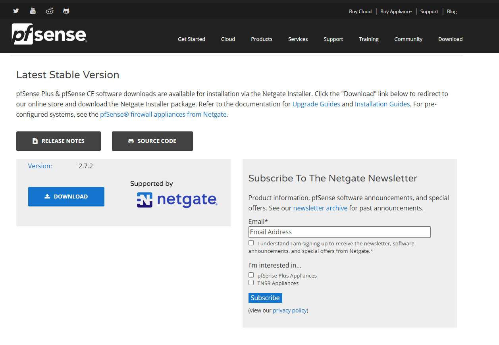
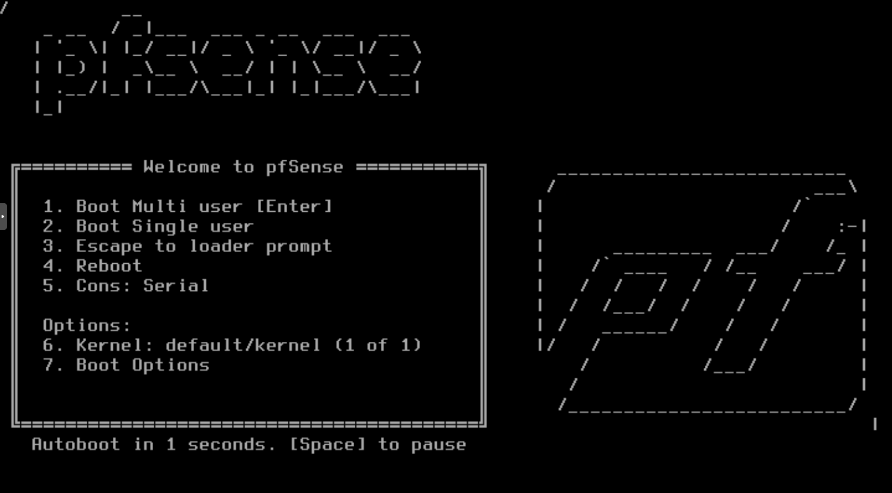
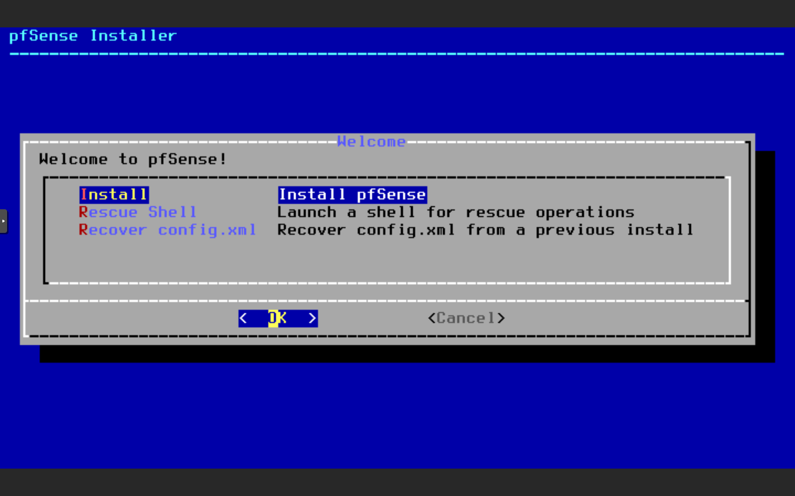

# Installation de pfSense

## Prérequis matériels

Avant de commencer l'installation de pfSense, assurez-vous d'avoir le matériel suivant :
- Un ordinateur ou un serveur avec au moins deux interfaces réseau (une pour le WAN et une pour le LAN)
- Un processeur compatible avec l'architecture x86-64
- Au moins 1 Go de RAM (2 Go ou plus recommandés)
- Au moins 4 Go d'espace disque (8 Go ou plus recommandés)
- Un lecteur USB ou un CD/DVD pour l'installation

## Étapes d'installation

### 1. Téléchargement de l'image d'installation

1. Rendez-vous sur le site officiel de pfSense : [https://www.pfsense.org/download/](https://www.pfsense.org/download/)
2. Sélectionnez la version de pfSense que vous souhaitez installer.
3. Choisissez l'architecture appropriée (généralement AMD64 pour les systèmes modernes).
4. Sélectionnez le type d'installation (USB Memstick Installer ou CD Image).
5. Téléchargez l'image d'installation.

### 2. Création du support d'installation

1. Si vous avez téléchargé l'image USB, utilisez un outil comme Rufus pour créer une clé USB bootable.
2. Si vous avez téléchargé l'image CD, gravez l'image sur un CD/DVD.

### 3. Démarrage à partir du support d'installation

1. Insérez la clé USB ou le CD/DVD dans l'ordinateur ou le serveur sur lequel vous souhaitez installer pfSense.
2. Démarrez l'ordinateur et accédez au menu de démarrage (généralement en appuyant sur une touche comme F12, F2, ou ESC).
3. Sélectionnez le support d'installation (USB ou CD/DVD) comme périphérique de démarrage.

### 4. Installation de pfSense

1. Une fois que l'ordinateur a démarré à partir du support d'installation, vous verrez l'écran de bienvenue de pfSense.
2. Sélectionnez "Install" pour commencer l'installation.

3. Suivez les instructions à l'écran pour configurer les paramètres de base (langue, disposition du clavier, etc.).
4. Sélectionnez le disque sur lequel vous souhaitez installer pfSense.
5. Choisissez le type de partitionnement (généralement "Auto (UFS)" pour une installation standard).
6. Confirmez les paramètres et lancez l'installation.

### 5. Configuration initiale

1. Une fois l'installation terminée, redémarrez l'ordinateur.
2. Retirez le support d'installation (clé USB ou CD/DVD).
3. Lors du premier démarrage, vous serez invité à configurer les interfaces réseau (WAN et LAN).
4. Suivez les instructions à l'écran pour attribuer les interfaces et configurer les paramètres réseau de base.

### 6. Accès à l'interface web

1. Une fois la configuration initiale terminée, connectez un ordinateur au port LAN de pfSense.
2. Ouvrez un navigateur web et accédez à l'adresse IP du LAN (par défaut, [http://192.168.1.1](http://192.168.1.1)).
3. Connectez-vous à l'interface web avec les identifiants par défaut (utilisateur : admin, mot de passe : pfsense).

4. Changez le mot de passe par défaut et configurez les paramètres supplémentaires selon vos besoins.

## Conclusion

Vous avez maintenant installé et configuré pfSense sur votre matériel. Vous pouvez commencer à configurer des règles de pare-feu, des VPN, et d'autres fonctionnalités avancées selon vos besoins.
