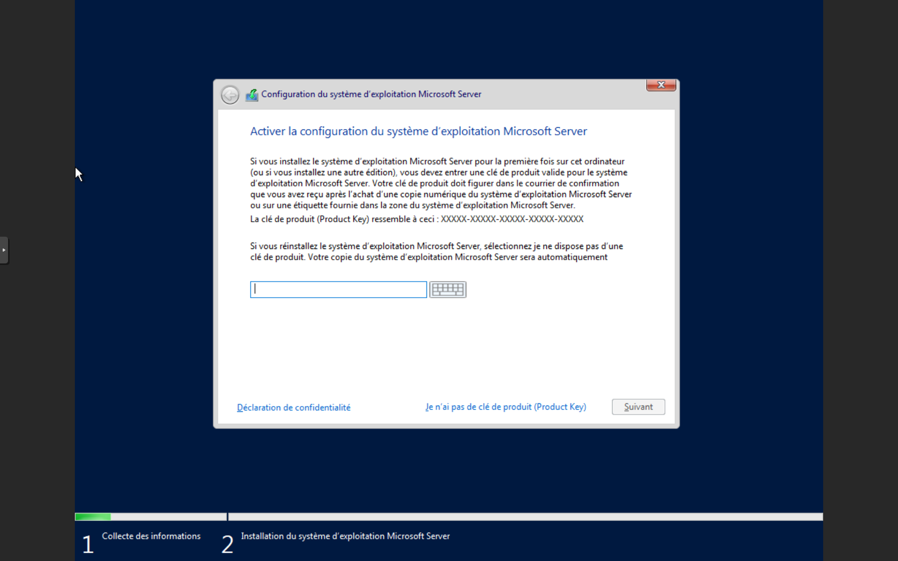
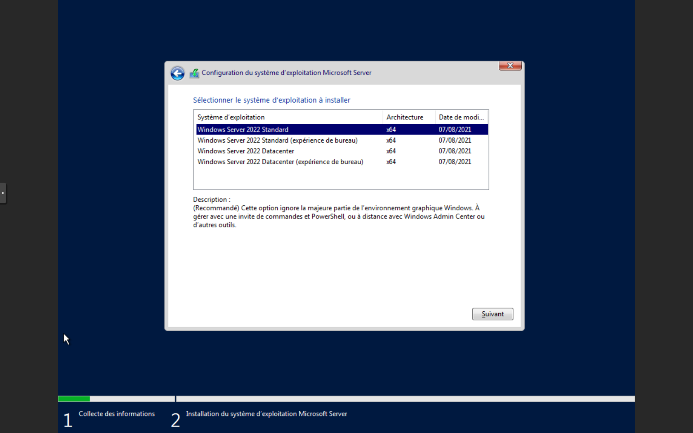
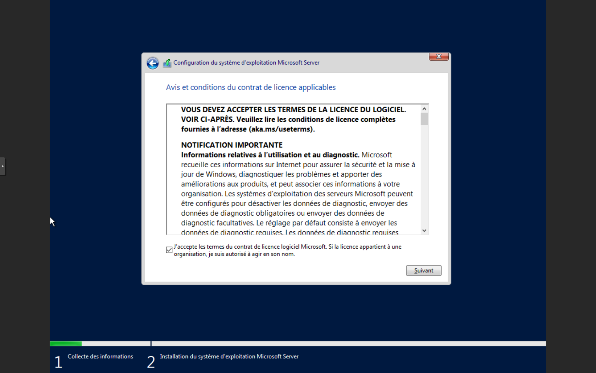
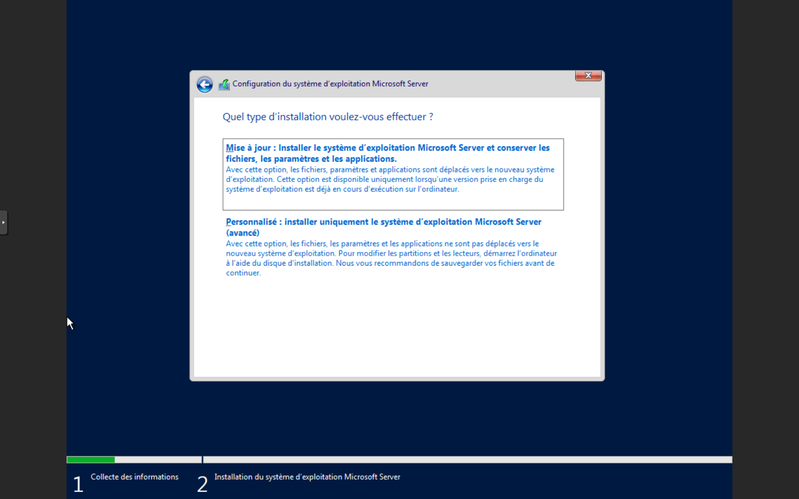
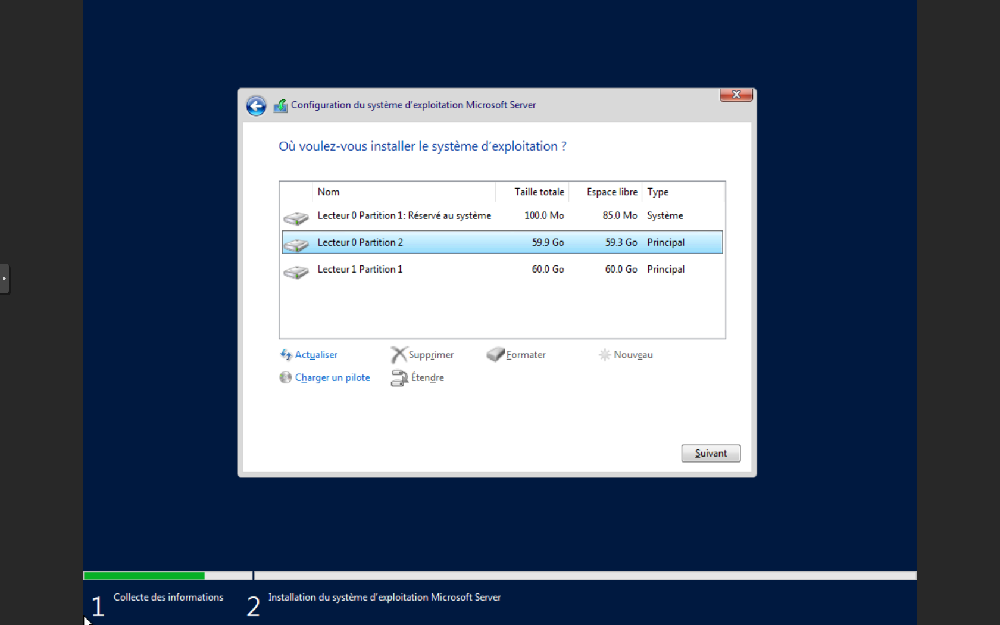
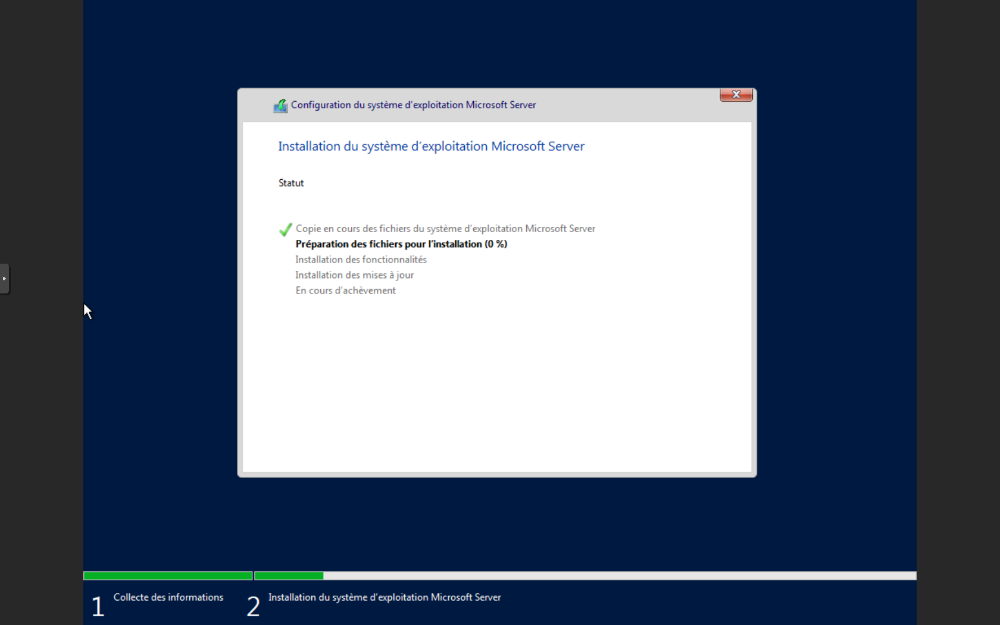
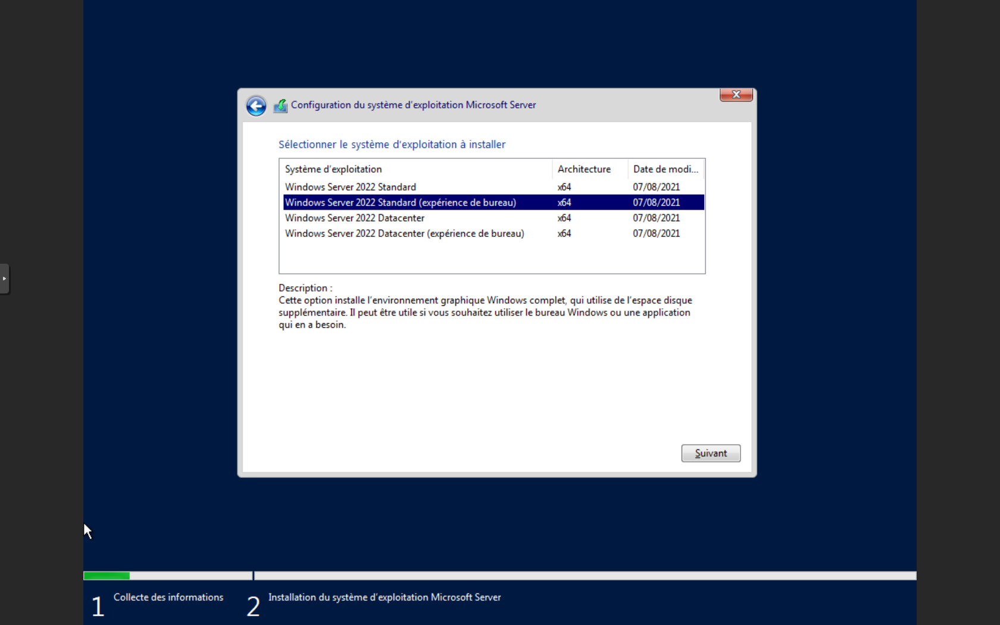

# Installation de Windows Server

## Prérequis matériels

Avant de commencer l'installation de Windows Server, assurez-vous d'avoir le matériel suivant :

- Un ordinateur, un serveur ou une machine virtuelle avec un processeur 64 bits
- Au moins 2 Go de RAM (4 Go ou plus recommandés)
- Au moins 32 Go d'espace disque (64 Go ou plus recommandés)
- Un second disque de 60 Go ou plus
- Un lecteur USB ou un CD/DVD pour l'installation

## Étapes d'installation

### 1. Téléchargement de l'image d'installation

1. Rendez-vous sur le site officiel de Microsoft : [https://www.microsoft.com/fr-fr/evalcenter/evaluate-windows-server-2022](https://www.microsoft.com/fr-fr/evalcenter/evaluate-windows-server-2022) ou un autre URL dépendant de la version que vous souhaitez installer.
2. Sélectionnez la version de Windows Server que vous souhaitez installer.
3. Téléchargez l'image d'installation.

### 2. Création du support d'installation

1. Si vous avez téléchargé l'image USB, utilisez un outil comme Rufus pour créer une clé USB bootable.
2. Si vous avez téléchargé l'image CD, gravez l'image sur un CD/DVD.
3. Si vous installez sur une machine virtuelle, vous pouvez monter directement l'image ISO sans créer de support physique.

### 3. Démarrage à partir du support d'installation

1. Insérez la clé USB ou le CD/DVD dans l'ordinateur ou le serveur sur lequel vous souhaitez installer Windows Server.
2. Démarrez l'ordinateur et accédez au menu de démarrage (généralement en appuyant sur une touche comme F12, F2, ou ESC).
3. Sélectionnez le support d'installation (USB ou CD/DVD) comme périphérique de démarrage.

### 4. Installation de Windows Server

#### Installation de Windows Server Core

1. Une fois que l'ordinateur a démarré à partir du support d'installation, vous verrez l'écran de bienvenue de Windows Server.
2. Suivez les instructions à l'écran pour configurer les paramètres de base (langue, disposition du clavier, etc.).

3. Sélectionnez "Installer maintenant" pour commencer l'installation.

4. Entrez la clé de produit lorsque vous y êtes invité. Vous pouvez trouver la clé de produit sur l'emballage du produit ou dans l'e-mail de confirmation si vous avez acheté une version numérique.

5. Sélectionnez "Windows Server 2022 Standard" sans Expérience de Bureau comme type d'installation.

6. Lisez attentivement les termes et conditions du contrat de licence.
7. Cochez la case "J'accepte les termes du contrat de licence" pour accepter les conditions.
8. Cliquez sur "Suivant" pour continuer l'installation.

9. Choisissez l'option "Personnalisé : installer uniquement le système d'exploitation Microsoft Server (avancé)".

10. Formatez les deux disques disponibles.
11. Choisissez le premier disque pour l'installation de Windows Server.

12. Cliquez sur "Suivant" et patientez pendant l'installation.

#### Installation de Windows Server avec Expérience de Bureau

Les étapes d'installation sont les mêmes que pour Windows Server Core, sauf pour la sélection de la version. Choisissez "Windows Server 2022 Standard" avec Expérience de Bureau comme type d'installation.

### 5. Configuration initiale

1. Une fois l'installation terminée, redémarrez l'ordinateur.
2. Retirez le support d'installation (clé USB ou CD/DVD).
3. Lors du premier démarrage, vous serez invité à configurer les paramètres de base (nom d'utilisateur, mot de passe, etc.).
4. Suivez les instructions de la documentation sur la configuration initiale.
