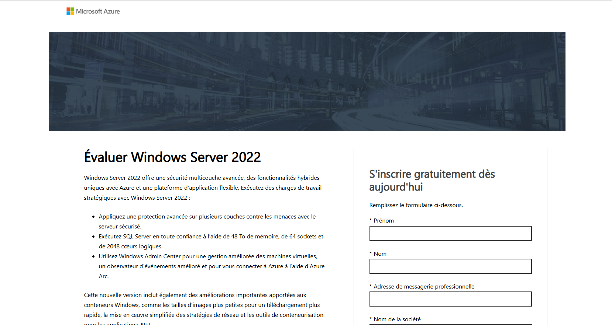
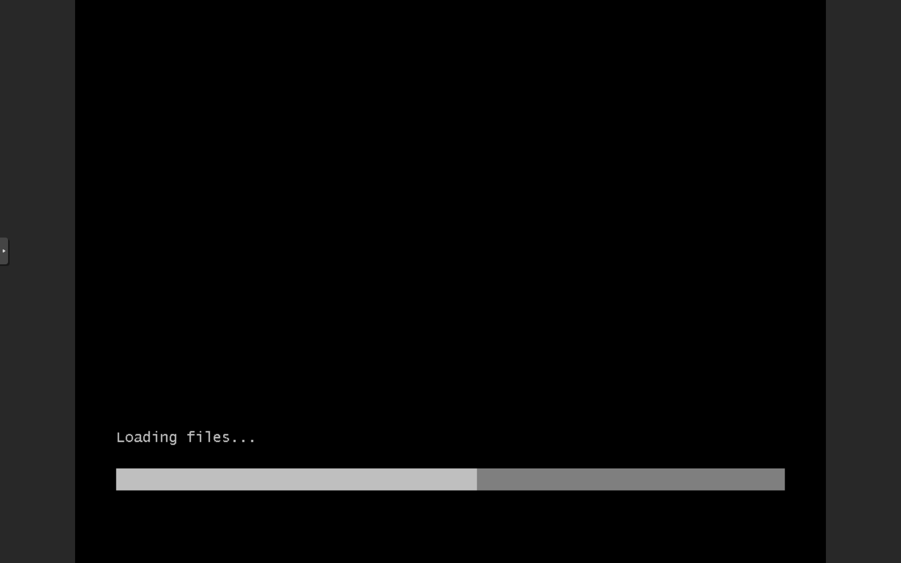
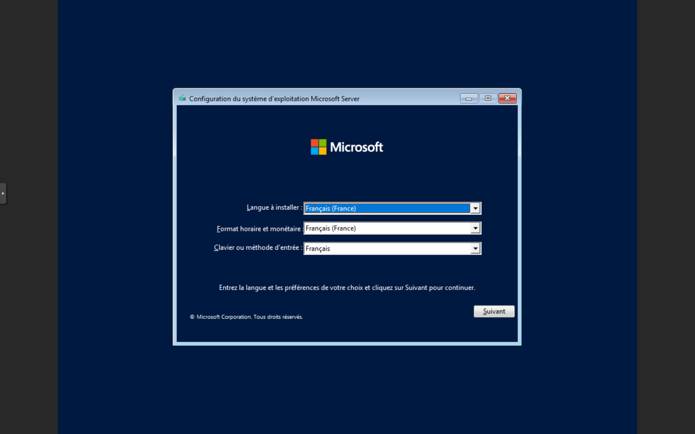
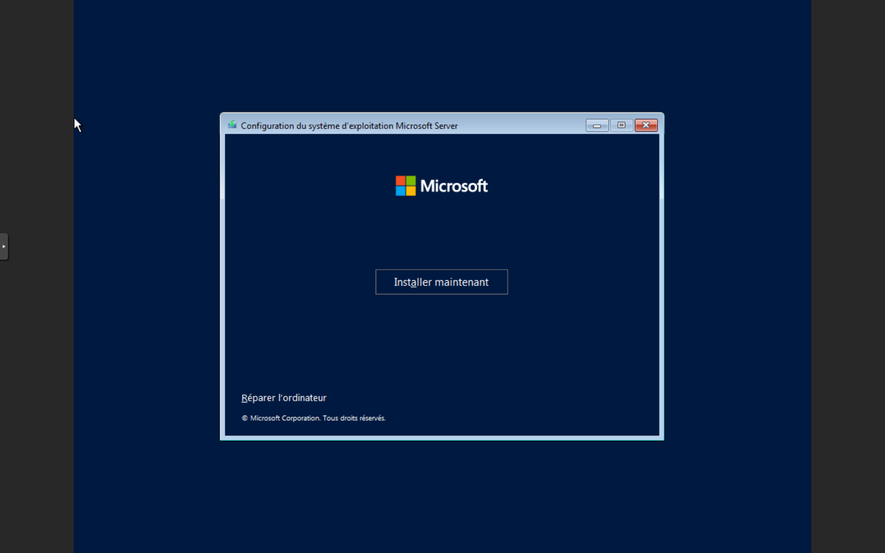

# Installation de Windows Server

## Prérequis matériels

Avant de commencer l'installation de Windows Server, assurez-vous d'avoir le matériel suivant :
- Un ordinateur ou un serveur avec un processeur 64 bits
- Au moins 2 Go de RAM (4 Go ou plus recommandés)
- Au moins 32 Go d'espace disque (64 Go ou plus recommandés)
- Un lecteur USB ou un CD/DVD pour l'installation

## Étapes d'installation

### 1. Téléchargement de l'image d'installation

1. Rendez-vous sur le site officiel de Microsoft : [https://www.microsoft.com/en-us/evalcenter/evaluate-windows-server](https://www.microsoft.com/en-us/evalcenter/evaluate-windows-server)
2. Sélectionnez la version de Windows Server que vous souhaitez installer.
3. Téléchargez l'image d'installation.

### 2. Création du support d'installation

1. Si vous avez téléchargé l'image USB, utilisez un outil comme Rufus pour créer une clé USB bootable.
2. Si vous avez téléchargé l'image CD, gravez l'image sur un CD/DVD.

### 3. Démarrage à partir du support d'installation

1. Insérez la clé USB ou le CD/DVD dans l'ordinateur ou le serveur sur lequel vous souhaitez installer Windows Server.
2. Démarrez l'ordinateur et accédez au menu de démarrage (généralement en appuyant sur une touche comme F12, F2, ou ESC).
3. Sélectionnez le support d'installation (USB ou CD/DVD) comme périphérique de démarrage.

### 4. Installation de Windows Server

1. Une fois que l'ordinateur a démarré à partir du support d'installation, vous verrez l'écran de bienvenue de Windows Server.
2. Sélectionnez "Installer maintenant" pour commencer l'installation.

3. Suivez les instructions à l'écran pour configurer les paramètres de base (langue, disposition du clavier, etc.).
4. Sélectionnez le disque sur lequel vous souhaitez installer Windows Server.
5. Choisissez le type de partitionnement (généralement "Personnalisé" pour une installation standard).
6. Confirmez les paramètres et lancez l'installation.

### 5. Configuration initiale

1. Une fois l'installation terminée, redémarrez l'ordinateur.
2. Retirez le support d'installation (clé USB ou CD/DVD).
3. Lors du premier démarrage, vous serez invité à configurer les paramètres de base (nom d'utilisateur, mot de passe, etc.).
4. Suivez les instructions à l'écran pour terminer la configuration initiale.

### 6. Accès à l'interface de gestion

1. Une fois la configuration initiale terminée, connectez-vous à l'interface de gestion de Windows Server.
2. Ouvrez le Gestionnaire de serveur pour commencer à configurer les rôles et fonctionnalités supplémentaires selon vos besoins.

## Conclusion

Vous avez maintenant installé et configuré Windows Server sur votre matériel. Vous pouvez commencer à configurer des rôles et des fonctionnalités supplémentaires selon vos besoins.
